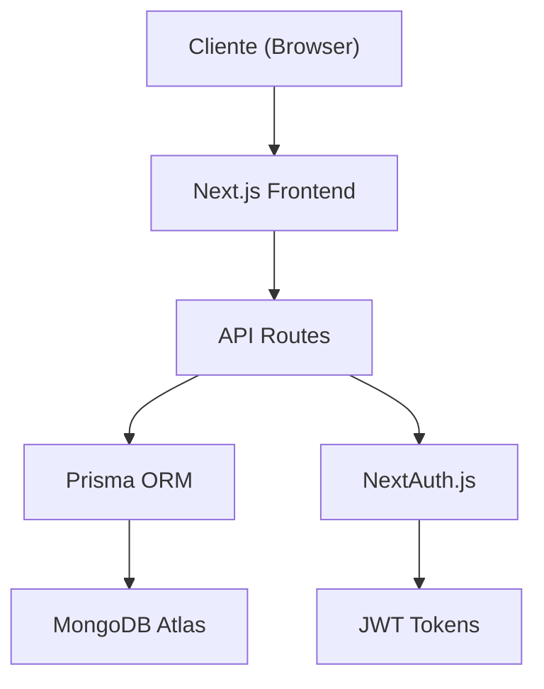

# 📚 Documentación del Sistema EduTrack

  <h2>Documentación Completa del Proyecto</h2>
  
Sistema de Gestión de Asistencias para la FUP

---

## 📖 Índice de Documentación

### 📋 **Documentos Principales**

1. **[Vista General del Proyecto](./01_PROJECT_OVERVIEW.md)**
   - Información del equipo y roles del sistema
   - Visión del producto y metodología

2. **[Especificación de la API](./02_API_SPECIFICATION.md)**
   - Endpoints y documentación técnica
   - Esquemas de datos y validaciones

3. **[Gestión del Proyecto](./03_PROJECT_MANAGEMENT.md)**
   - Metodología y planificación
   - Sprints y entregas

4. **[Documentación de Base de Datos](./04_DATABASE.md)**
   - Esquemas y relaciones
   - Migraciones y semillas

---

## 🏗️ **Arquitectura del Sistema**

### Componentes Principales

- **Frontend**: Next.js 15 con React 19 y TypeScript
- **Backend**: API Routes de Next.js
- **Base de Datos**: MongoDB con Prisma ORM
- **Autenticación**: NextAuth.js con JWT
- **UI**: shadcn/ui + Tailwind CSS

### Flujo de Datos

---

## 📚 **Historias de Usuario y Épicas**

### **[Epic 1: Gestión de Usuarios](./user_stories/EPIC_01_USER_MANAGEMENT.md)** ✅ COMPLETADO

- Autenticación y autorización
- Gestión de roles y permisos
- Perfiles de usuario

### **[Epic 2: Gestión Académica](./user_stories/EPIC_02_ACADEMIC_MANAGEMENT.md)** ✅ COMPLETADO

- Administración de asignaturas
- Inscripción de estudiantes
- Gestión de programas académicos

### **[Epic 3: Programación de Clases](./user_stories/EPIC_03_CLASS_SCHEDULING.md)** ✅ COMPLETADO

- Creación y gestión de clases
- Horarios y calendario
- Notificaciones de clases

### **[Epic 4: Sistema QR](./user_stories/EPIC_04_QR_SYSTEM.md)** ✅ COMPLETADO

- Generación de códigos QR seguros
- Validación temporal
- Interfaz de escaneo

### **[Epic 5: Seguimiento de Asistencia](./user_stories/EPIC_05_ATTENDANCE_TRACKING.md)** ✅ COMPLETADO

- Registro automático vía QR
- Ajustes manuales
- Historial de asistencias

### **[Epic 6: Reportes y Analíticas](./user_stories/EPIC_06_REPORTS_ANALYTICS.md)** ✅ COMPLETADO

- Generación de reportes PDF
- Dashboard con métricas
- Exportación de datos

### **[Epic 7: Comunicaciones](./user_stories/EPIC_07_COMMUNICATION.md)** 🚧 EN DESARROLLO

- Notificaciones por email
- Integración WhatsApp Business
- Plantillas personalizadas

### **[Epic 8: Administración](./user_stories/EPIC_08_ADMINISTRATION.md)** ✅ COMPLETADO

- Panel de administración
- Carga masiva de datos
- Configuración del sistema

---

## 📊 **Estado Actual del Proyecto**

### Funcionalidades Implementadas ✅

- **Autenticación completa** con roles y permisos
- **Panel administrativo** con gestión de usuarios
- **Sistema QR** con generación y validación segura
- **Dashboard** con analíticas en tiempo real
- **Reportes PDF** con firmas digitales
- **Carga masiva** de datos con validación

### En Desarrollo 🚧

- Sistema de notificaciones por email
- Integración con WhatsApp Business
- Testing automatizado completo
- Optimizaciones de rendimiento

### Pendiente ⏳

- Integración con calendario Outlook
- Módulo de backup automático

---
