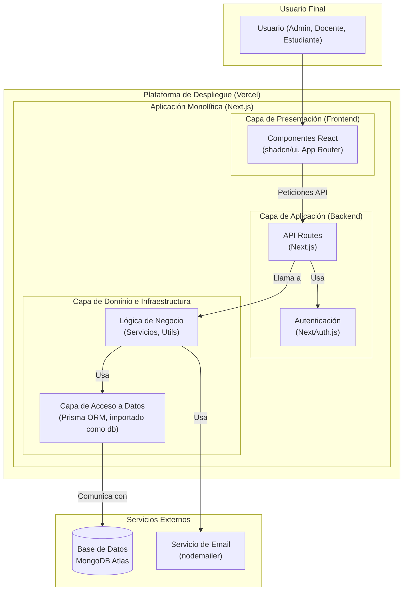

# Patrón Arquitectónico: Monolito Moderno sobre Arquitectura Serverless

## Descripción

El sistema sigue un patrón de **Monolito Moderno (Modular)**. A diferencia de un monolito tradicional, donde el acoplamiento es alto, este enfoque organiza el código en módulos lógicos y bien definidos, promoviendo una alta cohesión y un bajo acoplamiento entre las partes.

Toda la aplicación, tanto el **Frontend (Next.js con App Router)** como el **Backend (API Routes)**, reside en un único repositorio y se despliega como una sola unidad en **Vercel**.

## Ventajas de este enfoque

- **Simplicidad de Desarrollo y Despliegue**: Un único codebase simplifica la gestión de dependencias, las pruebas y el proceso de CI/CD.
- **Rendimiento Optimizado**: La coubicación del frontend y el backend reduce la latencia en la comunicación.
- **Escalabilidad Serverless**: Aunque es un monolito en desarrollo, Vercel lo despliega como un conjunto de funciones serverless, lo que permite una escalabilidad automática y eficiente basada en la demanda.
- **Mantenibilidad**: La estructura modular facilita la comprensión, el mantenimiento y la evolución del sistema.

## Diagrama del Patrón Arquitectónico

