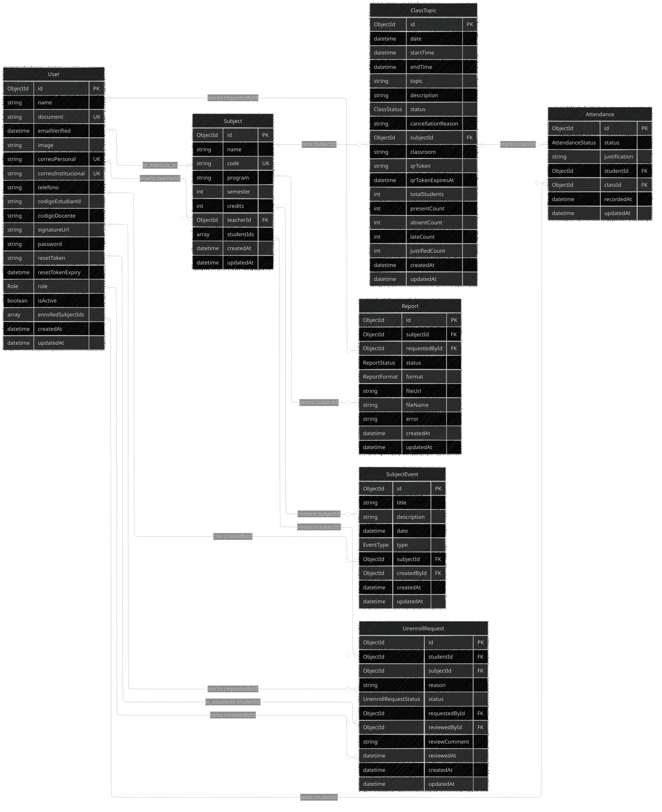

# Modelo de Datos (Colecciones MongoDB)

```mermaid
---
config:
  theme: dark
  look: handDrawn
  layout: elk
  er:
    fontSize: 12
    useMaxWidth: true
  fontFamily: 'Segoe UI, Tahoma, Geneva, Verdana, sans-serif'
---
erDiagram
    direction LR
    User {
        ObjectId id PK
        string name
        string document UK
        datetime emailVerified
        string image
        string correoPersonal UK
        string correoInstitucional UK
        string telefono
        string codigoEstudiantil
        string codigoDocente
        string signatureUrl
        string password
        string resetToken
        datetime resetTokenExpiry
        Role role
        boolean isActive
        array enrolledSubjectIds
        datetime createdAt
        datetime updatedAt
    }
    Subject {
        ObjectId id PK
        string name
        string code UK
        string program
        int semester
        int credits
        ObjectId teacherId FK
        array studentIds
        datetime createdAt
        datetime updatedAt
    }
    ClassTopic {
        ObjectId id PK
        datetime date
        datetime startTime
        datetime endTime
        string topic
        string description
        ClassStatus status
        string cancellationReason
        ObjectId subjectId FK
        string classroom
        string qrToken
        datetime qrTokenExpiresAt
        int totalStudents
        int presentCount
        int absentCount
        int lateCount
        int justifiedCount
        datetime createdAt
        datetime updatedAt
    }
    Attendance {
        ObjectId id PK
        AttendanceStatus status
        string justification
        ObjectId studentId FK
        ObjectId classId FK
        datetime recordedAt
        datetime updatedAt
    }
    Report {
        ObjectId id PK
        ObjectId subjectId FK
        ObjectId requestedById FK
        ReportStatus status
        ReportFormat format
        string fileUrl
        string fileName
        string error
        datetime createdAt
        datetime updatedAt
    }
    SubjectEvent {
        ObjectId id PK
        string title
        string description
        datetime date
        EventType type
        ObjectId subjectId FK
        ObjectId createdById FK
        datetime createdAt
        datetime updatedAt
    }
    UnenrollRequest {
        ObjectId id PK
        ObjectId studentId FK
        ObjectId subjectId FK
        string reason
        UnenrollRequestStatus status
        ObjectId requestedById FK
        ObjectId reviewedById FK
        string reviewComment
        datetime reviewedAt
        datetime createdAt
        datetime updatedAt
    }
    User ||--o{ Subject : "enseña (teacherId)"
    User ||--o{ Attendance : "asiste (studentId)"
    User ||--o{ Report : "solicita (requestedById)"
    User ||--o{ SubjectEvent : "crea (createdById)"
    User ||--o{ UnenrollRequest : "solicita (requestedById)"
    User ||--o{ UnenrollRequest : "es_estudiante (studentId)"
    User ||--o{ UnenrollRequest : "revisa (reviewedById)"
    Subject ||--o{ ClassTopic : "tiene (subjectId)"
    Subject ||--o{ Report : "genera (subjectId)"
    Subject ||--o{ SubjectEvent : "contiene (subjectId)"
    Subject ||--o{ UnenrollRequest : "involucra (subjectId)"
    ClassTopic ||--o{ Attendance : "registra (classId)"
    User }|--|| Subject : "se_matricula_en"

```
