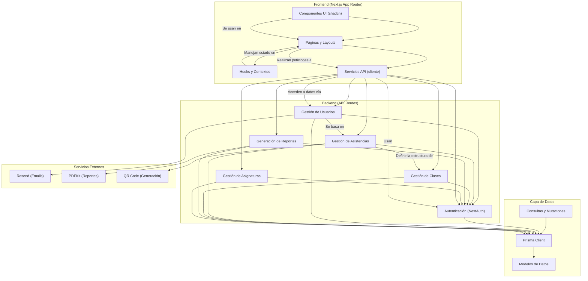

# Diagrama de Componentes

## Descripción de los Componentes

### Frontend

- **Componentes UI**: Biblioteca de componentes reutilizables de shadcn/ui
- **Páginas y Layouts**: Estructura de rutas y plantillas de la aplicación
- **Hooks y Contextos**: Gestión de estado global (autenticación, temas, etc.)
- **Servicios API**: Cliente para consumir los endpoints del backend

### Backend

- **Autenticación**: Gestión de sesiones y autorización
- **Gestión de Usuarios**: CRUD de usuarios, roles y permisos
- **Gestión de Asistencias**: Registro y consulta de asistencias
- **Gestión de Clases**: Programación y seguimiento de clases
- **Generación de Reportes**: Creación de informes en PDF
- **Gestión de Asignaturas**: Administración de materias y matrículas

### Capa de Datos

- **Prisma Client**: ORM para interactuar con MongoDB
- **Modelos de Datos**: Definición de entidades y relaciones
- **Consultas y Mutaciones**: Operaciones específicas de la base de datos

### Servicios Externos

- **Resend**: Envío de notificaciones por correo electrónico
- **PDFKit**: Generación de documentos PDF para reportes
- **QR Code**: Generación de códigos QR para registro de asistencia

## Base de Datos

El sistema utiliza **MongoDB** como base de datos principal, accedida a través de Prisma ORM. Los datos se almacenan en **MongoDB Atlas** en la nube.
