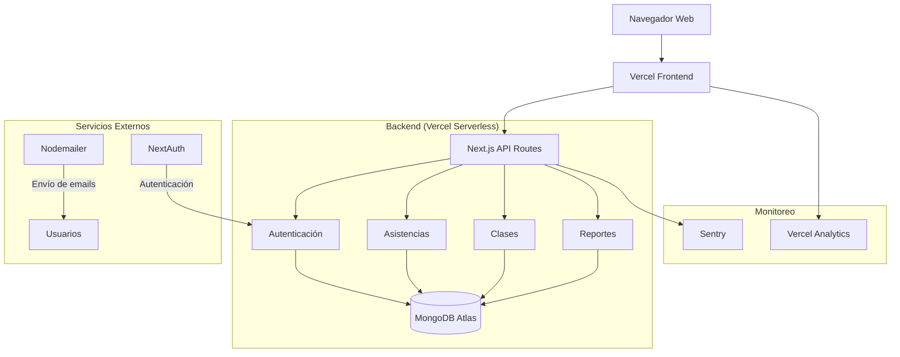

# Diagrama de Contenedores

```mermaid
graph TD
    A[Navegador Web] --> B[Vercel Frontend] --> C[Next.js API Routes]

    subgraph "Backend (Vercel Serverless)"
        C --> D[Autenticación]
        C --> E[Asistencias]
        C --> F[Clases]
        C --> G[Reportes]

        D --> H[(MongoDB Atlas)]
        E --> H
        F --> H
        G --> H
    end

    subgraph "Servicios Externos"
        I[Nodemailer] -->|Envío de emails| J[Usuarios]
        K[NextAuth] -->|Autenticación| D
    end

    subgraph "Monitoreo"
        L[Vercel Analytics]
        M[Sentry]
    end

    B --> L
    C --> M
```
