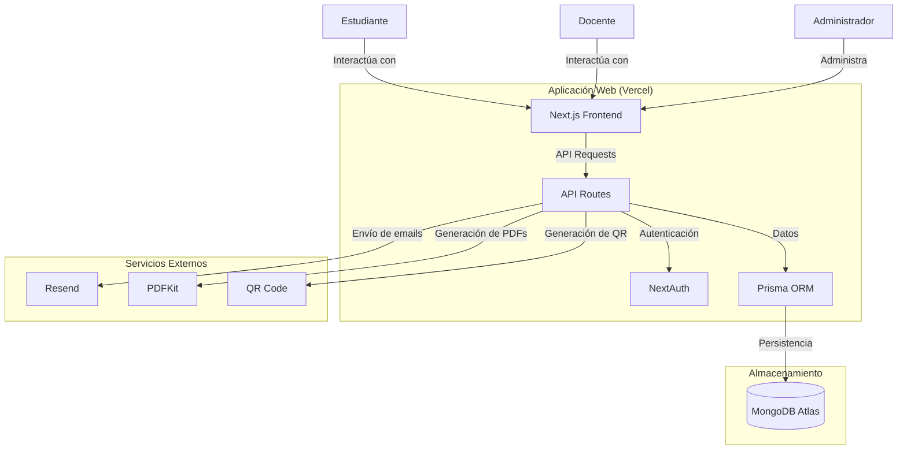

# Diagrama de Contexto

## Descripción de las Interacciones

1. **Usuarios**:
   - **Estudiantes**: Registran asistencia, consultan su historial.
   - **Docentes**: Gestionan clases, generan códigos QR, revisan asistencias.
   - **Administradores**: Gestionan usuarios, asignaturas y reportes.

2. **Servicios Principales**:
   - **Autenticación**: Gestionada por NextAuth con soporte para múltiples proveedores.
   - **API Routes**: Endpoints RESTful para operaciones del sistema.
   - **ORM**: Prisma como capa de abstracción sobre MongoDB.

3. **Integraciones Externas**:
   - **Resend**: Para envío de notificaciones por correo.
   - **PDFKit**: Generación de reportes en formato PDF.
   - **QR Code**: Generación de códigos QR para registro de asistencia.
