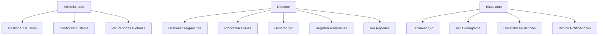

# Diagrama de Casos de Uso Principal

```mermaid
graph TB
    A[Administrador] --> B[Gestionar Usuarios]
    A --> C[Configurar Sistema]
    A --> D[Ver Reportes Globales]

    E[Docente] --> F[Gestionar Asignaturas]
    E --> G[Programar Clases]
    E --> H[Generar QR]
    E --> I[Registrar Asistencias]
    E --> J[Ver Reportes]

    K[Estudiante] --> L[Escanear QR]
    K --> M[Ver Cronograma]
    K --> N[Consultar Asistencias]
    K --> O[Recibir Notificaciones]
```
