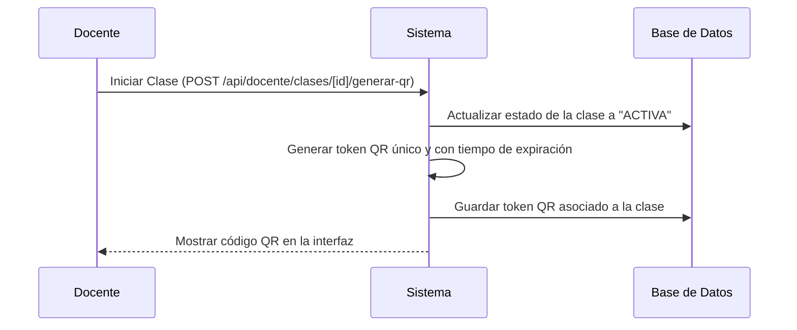
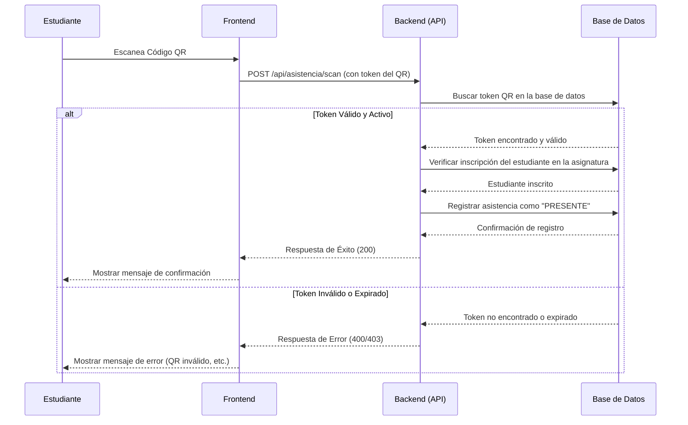

# Diagrama de Secuencia - Flujo Completo de Asistencia QR

Este documento describe el flujo completo para la gestión de asistencia, desde que el docente inicia la clase hasta que el estudiante registra su asistencia.

## 1. Generación del Código QR

Este diagrama muestra cómo el docente inicia una clase y el sistema genera el código QR correspondiente.

## 2. Registro de Asistencia del Estudiante

Este diagrama muestra el proceso cuando un estudiante escanea el código QR para registrar su asistencia.

