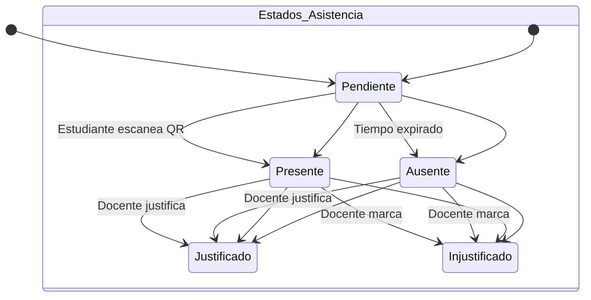

# Diagrama de Estados - Flujo de Asistencia

```mermaid
stateDiagram-v2
    [*] --> Pendiente
    state Estados_Asistencia {
        [*] --> Pendiente
        Pendiente --> Presente: Estudiante escanea QR
        Pendiente --> Ausente: Tiempo expirado
        Presente --> Justificado: Docente justifica
        Ausente --> Justificado: Docente justifica
        Presente --> Injustificado: Docente marca
        Ausente --> Injustificado: Docente marca
        Pendiente --> Presente
        Pendiente --> Ausente
        Presente --> Justificado
        Ausente --> Justificado
        Presente --> Injustificado
        Ausente --> Injustificado
    }
```
